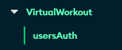
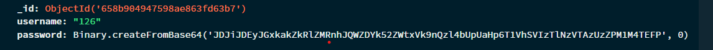

# VirtualWorkOut

This project uses mediapipe to identify a person's pose landmarks, calculates its relative positions, and classify if 
the user's physical actions is or is not the correct movement for the chosen workout (calculations needs more tweakings). 

It also uses mongoDB-atlas for user authentication, so if you want to run the app locally you will need a mongodbatlas database with below setup:

You can check out the live version hosted on heroku here: 
Note: the live version is not fully functional as heroku cannot access webcams. To fully run the app you'd have to 
download and run following instructions below: 

1: Install the following (or check requirements.txt):

pip install opencv-python

python -m pip install mediapipe 

pip install Flask

pip install requests

pip install Flask-Bcrypt

pip install Flask-SQLAlchemy

2: create a file named "config.py" containing the code below:
...
class Config:
    MONGO_URI = 'your-mongodb-atlas-connection-string'
...

3: run "python app.py" to run the app! Thanks for checking this project out :D

Credits:

Used this tutorial for setting up OpenCV and MediaPipe: https://youtu.be/ZI2-Xl0J8S4?si=1r7XGMbbW50u1YsE
Used this tutorial to display OpenCV feed: https://youtu.be/vF9QRJwJXJk?si=ysEFL1dJt5qaeXl8